# Call Center HRMS Enterprise SaaS
## Software Architecture Document (SAD) & Software Requirements Specification (SRS)

| | |
|---|---|
| **Product** | Call Center HRMS Enterprise SaaS |
| **Version** | 1.0 |
| **Status** | Production-Ready Design |
| **Architecture** | Multi-Tenant SaaS (Shared Database, Row-Level Isolation) |
| **Stack** | Laravel 13 · PHP 8.4 · PostgreSQL · Redis · React 19 · TypeScript |
| **Audience** | Development Team, DevOps, Product, QA |

---

# Table of Contents

1. [System Overview](#1-system-overview)
2. [Business Model](#2-business-model)
3. [SaaS Multi-Tenant Architecture](#3-saas-multi-tenant-architecture)
4. [User Authentication Architecture](#4-user-authentication-architecture)
5. [Authorization Architecture (RBAC)](#5-authorization-architecture-rbac)
6. [Database Architecture](#6-database-architecture)
7. [API Architecture](#7-api-architecture)
8. [Frontend Architecture](#8-frontend-architecture)
9. [Backend Architecture](#9-backend-architecture)
10. [Modules — Detailed Design](#10-modules--detailed-design)
11. [Reports Module](#11-reports-module)
12. [UI/UX Design & Screens](#12-uiux-design--screens)
13. [Sidebar Menus](#13-sidebar-menus)
14. [Security Architecture](#14-security-architecture)
15. [Audit Logging System](#15-audit-logging-system)
16. [Notification System](#16-notification-system)
17. [Deployment Architecture](#17-deployment-architecture)
18. [Backup Strategy](#18-backup-strategy)
19. [Scaling Strategy](#19-scaling-strategy)
20. [Permissions Matrix](#20-permissions-matrix)
21. [Key Workflows & User Flows](#21-key-workflows--user-flows)
22. [Non-Functional Requirements](#22-non-functional-requirements)

---

# 1. System Overview

## 1.1 Purpose

Call Center HRMS Enterprise SaaS is an internal Human Resource Management platform built specifically for **call center companies**. Multiple companies (tenants) register on the platform and independently manage their entire HR lifecycle: employees (agents), recruitment, attendance, shifts, leave, payroll, performance/KPIs, quality assurance, and call center analytics.

## 1.2 Core Design Principles

- **Two roles only.** Every tenant has exactly two user types: **Company Owner** (strategic oversight, billing, admin lifecycle) and **Administrator (HR)** (all daily operations). There is **no employee/agent login** — agents exist purely as data records managed by the Administrator.
- **Strict tenant isolation.** Every business record is scoped by `company_id`. No tenant can ever read or write another tenant's data.
- **API-first.** A single versioned REST API (`/api/v1`) serves the React SPA and any future Flutter admin app.
- **Auditable by default.** Every mutating action is written to an immutable audit log.
- **Enterprise UX.** Interface quality benchmarked against SAP SuccessFactors, Workday, BambooHR, and Zoho People.

## 1.3 High-Level System Diagram

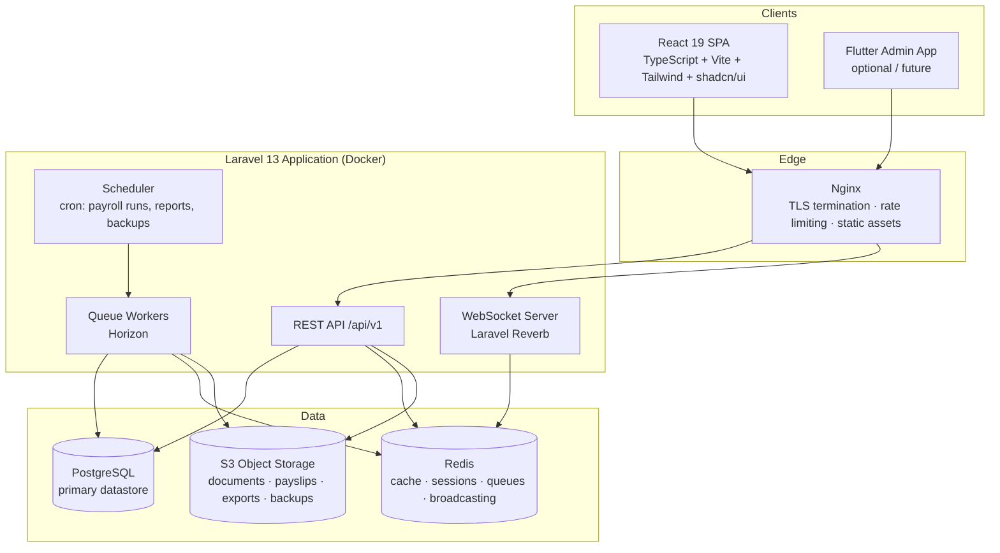

## 1.4 Scope Summary (SRS)

**In scope:**

- Multi-tenant company registration, subscription and billing management
- Company structure: branches, departments, positions, working hours, holidays, policies
- Full employee (agent) database with documents
- Recruitment pipeline: jobs → applicants → interviews → hiring → onboarding
- Attendance (check-in/out, late, absence, overtime) — entered/managed by Administrator
- Shift creation, assignment, rotation and schedule planning (incl. night shifts)
- Leave types, requests (recorded on behalf of agents), approvals, balances
- Payroll: salary structures, allowances, deductions, overtime, bonus, commission, payroll runs, payslip PDFs
- Performance: KPIs, targets, scores, rankings, monthly evaluations
- Call center analytics: call volumes, AHT, CSAT, conversion — data entered or imported (CSV) by Administrator
- Quality management: evaluation forms, QA scores, coaching notes
- Reports across every module with export (PDF/XLSX/CSV)
- Audit logs, notifications, dashboards for both roles

**Out of scope (v1):**

- Employee self-service portal or agent login of any kind
- Live telephony/PBX integration (analytics data is manual entry or CSV import; integration is a v2 roadmap item)
- Public careers page (applicants are entered by HR)

---

# 2. Business Model

## 2.1 Model

B2B SaaS subscription. Each call center company is a tenant paying a recurring fee based on plan tier and number of employee records.

## 2.2 Subscription Plans

| Plan | Target | Employee Records | Admin Seats | Key Limits/Features | Price Model |
|---|---|---|---|---|---|
| **Starter** | Small call centers | Up to 50 | 1 | Core HR + attendance + leave + basic payroll | Monthly flat |
| **Professional** | Growing centers | Up to 300 | 3 | + Shifts, recruitment, performance, analytics, branding | Monthly flat + per-employee overage |
| **Enterprise** | Large / BPO | Unlimited | 10 | + Quality mgmt, advanced reports, API access, priority support, custom retention | Annual contract |

Common to all plans: 14-day free trial, monthly/annual billing, proration on upgrades, grace period (7 days) on failed payment before read-only mode, data export on cancellation, hard delete after 90-day retention window.

## 2.3 Revenue & Billing Rules

- Billing engine: Laravel Cashier (Stripe) — card payments, invoices, webhooks for `invoice.paid`, `invoice.payment_failed`, `customer.subscription.updated`.
- Plan enforcement middleware: employee-count and feature checks (`FeatureGate`) evaluated per request against the tenant's active plan.
- Downgrade rule: blocked while current usage exceeds target plan limits; Owner is shown exactly what must be reduced.
- Suspension flow: `active → past_due (grace, banner shown) → read_only → suspended → purged (90 days)`.

## 2.4 Tenant Lifecycle

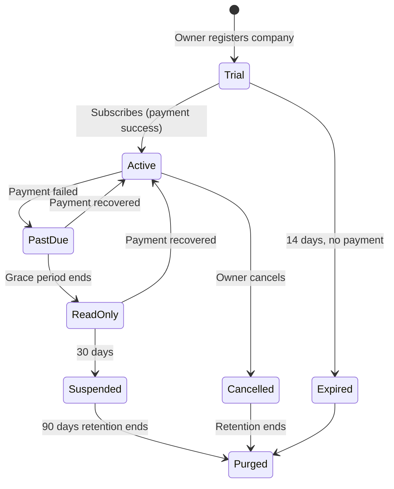

---

# 3. SaaS Multi-Tenant Architecture

## 3.1 Chosen Strategy: Shared Database, Shared Schema, Row-Level Isolation

Every tenant-owned table carries a `company_id` (UUID, FK → `companies.id`, indexed). Isolation is enforced at **four layers**:

1. **Application layer** — a global Eloquent `TenantScope` automatically appends `WHERE company_id = :current` to every query on tenant models; `company_id` is auto-filled on create and is never mass-assignable.
2. **Middleware layer** — `ResolveTenant` middleware derives the tenant from the authenticated user's `company_id` (never from client input) and binds a `TenantContext` singleton for the request lifecycle.
3. **Database layer (defense-in-depth)** — PostgreSQL **Row-Level Security (RLS)** policies on all tenant tables keyed to `current_setting('app.company_id')`, set per connection by Laravel.
4. **Authorization layer** — policies re-verify resource ownership (`$resource->company_id === $user->company_id`) before every mutation.

### Why shared-schema over database-per-tenant

| Criterion | Shared schema (chosen) | DB-per-tenant |
|---|---|---|
| Operational cost | One database to migrate, back up, monitor | N databases; migration fan-out risk |
| Onboarding speed | Instant (insert rows) | Provisioning step required |
| Cross-tenant platform analytics | Trivial | Hard |
| Isolation strength | Strong with RLS + scopes | Strongest |
| Fit for this product | ✅ Two-role internal tool, moderate per-tenant data volume | Overkill for v1 |

Enterprise-plan tenants demanding physical isolation can be migrated to a dedicated schema later; the `TenantContext` abstraction keeps this path open.

## 3.2 Tenant Resolution Flow

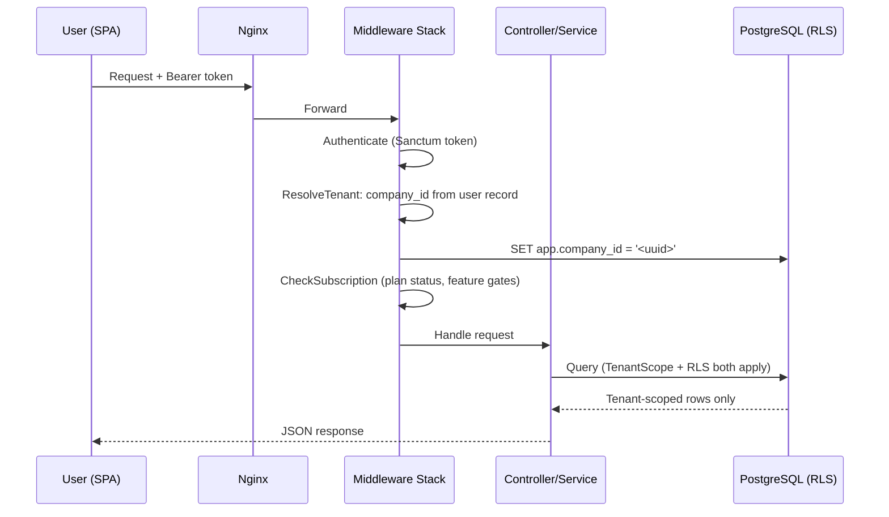

## 3.3 Shared vs Tenant Data

- **Platform-level (no company_id):** `plans`, `subscriptions` metadata (linked to company), platform admin users (internal Anthropic-style super-admin panel is out of tenant scope), system settings templates.
- **Tenant-level (company_id on every row):** everything else — users, employees, attendance, payroll, etc.
- **Files:** S3 keys are namespaced `tenants/{company_id}/{module}/{uuid}.{ext}`; all access via short-lived signed URLs generated after policy checks.
- **Cache/queues:** Redis keys prefixed `t:{company_id}:`; queued jobs carry `company_id` and re-establish tenant context on execution.

---

# 4. User Authentication Architecture

## 4.1 Identity Model

Only two authenticatable roles exist, both stored in `users`:

| Role | Created by | Cardinality per tenant |
|---|---|---|
| `owner` | Self-registration (company sign-up) | Exactly 1 |
| `admin` | Invitation by Owner | 1..N (plan-limited) |

**Agents/employees are not users.** They live in `employees` and have no credentials, no login route, no tokens — enforced structurally, not just by policy.

## 4.2 Authentication Method

- **Laravel Sanctum** bearer tokens for the SPA and future mobile app (stateless JWT-style personal access tokens with abilities, hashed at rest).
- Access token TTL: 60 minutes; refresh via `/auth/refresh` (rotating refresh token, TTL 14 days, single-use, family-revocation on reuse detection).
- Passwords: `argon2id`, min 12 chars, zxcvbn strength ≥ 3, breached-password check (k-anonymity HIBP), history of last 5 enforced.

## 4.3 Two-Factor Authentication (2FA)

- TOTP (RFC 6238) via authenticator apps; QR provisioning; 10 single-use recovery codes (hashed).
- **Mandatory for Owners**, strongly recommended (policy-configurable to mandatory) for Administrators.
- 2FA challenge issued after password success; short-lived `2fa_pending` token exchanged for full token on success.

## 4.4 Authentication Flows

**Registration (Owner):**
`POST /auth/register` → creates `companies` row (status `trial`) + `users` row (role `owner`) in one transaction → email verification link (signed, 24h) → onboarding wizard (company profile, first department, invite admin).

**Admin invitation:**
Owner sends invite → `admin_invitations` row with signed token (72h expiry, single-use) → email → invitee sets password + 2FA → `users` row (role `admin`) created bound to the same `company_id`.

**Login:**
Email + password → optional 2FA → token pair issued → device/session record created (`user_sessions`: IP, user agent, last active) → login event audit-logged. Brute-force protection: 5 attempts / 15 min per email+IP, exponential backoff, lockout notification email.

**Password reset:** signed token (30 min), invalidates all sessions on completion, audit-logged, notification sent.

## 4.5 Session Management

- Owner/Admin can view active sessions and revoke any or all ("log out everywhere").
- Absolute session lifetime 14 days; idle timeout enforced client + server side.
- Token revocation list in Redis for immediate invalidation.

---

# 5. Authorization Architecture (RBAC)

## 5.1 Model

Role-Based Access Control with a **permission registry** (future-proof even though v1 ships two fixed roles). Implementation: `spatie/laravel-permission` with roles `owner`, `admin`, permissions seeded per module (`employees.view`, `employees.create`, `payroll.process`, `billing.manage`, …). Laravel Policies wrap every model; controllers never check roles directly — always `$this->authorize()`.

## 5.2 Role Definitions

**Company Owner — strategic, read-mostly:**
company profile & branding, admin invite/remove, dashboards & business reports, employee statistics (read), payroll summary (read), subscription & billing, audit logs, system settings.

**Administrator (HR) — operational, full CRUD:**
employees, recruitment, attendance, shifts, leave, payroll processing, performance/KPI, call center analytics, quality management, reports, HR configuration (departments, positions, leave types, salary components, working hours, holidays).

Boundaries: Owner **cannot** edit employees, run payroll, or touch HR operations. Admin **cannot** manage billing/subscription, invite/remove admins, or edit company legal profile. (Full matrix in §20.)

## 5.3 Enforcement Layers

1. Route middleware: `role:owner` / `role:admin` / `permission:x`.
2. Policy classes per model (tenant ownership + permission).
3. Frontend route guards + conditional UI (never trusted, purely UX).
4. Query scoping (TenantScope) — even a bypassed check cannot leak cross-tenant data.

---

# 6. Database Architecture

## 6.1 Conventions

- PostgreSQL 16. Primary keys: `id UUID DEFAULT gen_random_uuid()`.
- Every tenant table: `company_id UUID NOT NULL REFERENCES companies(id)`, indexed and included in composite indexes as leading column.
- Timestamps: `created_at`, `updated_at TIMESTAMPTZ`; soft deletes (`deleted_at`) on business entities.
- Money: `NUMERIC(12,2)` + `currency CHAR(3)` on company. Enumerations: PostgreSQL `ENUM` or check-constrained `VARCHAR`.
- All FK columns indexed. Unique constraints are always composite with `company_id` (e.g. `UNIQUE(company_id, employee_code)`).

## 6.2 Platform & Identity Tables

### companies
| Column | Type | Notes |
|---|---|---|
| id | UUID PK | |
| name | VARCHAR(150) | |
| slug | VARCHAR(150) UNIQUE | subdomain-ready |
| legal_name | VARCHAR(200) | |
| registration_no | VARCHAR(100) NULL | |
| email, phone | VARCHAR | |
| address, city, country | VARCHAR | |
| timezone | VARCHAR(64) | default UTC |
| currency | CHAR(3) | e.g. TZS, USD |
| logo_path | VARCHAR NULL | S3 key |
| brand_primary_color | CHAR(7) NULL | branding |
| status | ENUM(trial, active, past_due, read_only, suspended, cancelled) | |
| trial_ends_at | TIMESTAMPTZ | |
| settings | JSONB | company-level settings |
| created_at / updated_at / deleted_at | TIMESTAMPTZ | |

### plans
`id, code UNIQUE(starter/professional/enterprise), name, max_employees INT NULL, max_admins INT, features JSONB, price_monthly NUMERIC, price_yearly NUMERIC, is_active BOOL`

### subscriptions
`id, company_id FK, plan_id FK, provider(stripe), provider_subscription_id, status ENUM(trialing,active,past_due,canceled), billing_cycle ENUM(monthly,yearly), current_period_start/end TIMESTAMPTZ, canceled_at NULL`
Indexes: `(company_id)`, `(provider_subscription_id)`

### invoices
`id, company_id FK, subscription_id FK, provider_invoice_id, number, amount NUMERIC(12,2), currency, status ENUM(paid,open,void,uncollectible), pdf_path, issued_at, paid_at NULL`

### users
| Column | Type | Notes |
|---|---|---|
| id | UUID PK | |
| company_id | UUID FK | |
| role | ENUM(owner, admin) | |
| name | VARCHAR(120) | |
| email | VARCHAR(190) | UNIQUE(company_id, email); also globally unique for login |
| password | VARCHAR | argon2id hash |
| two_factor_secret | TEXT NULL | encrypted |
| two_factor_recovery_codes | TEXT NULL | encrypted |
| two_factor_enabled_at | TIMESTAMPTZ NULL | |
| status | ENUM(active, disabled) | |
| last_login_at | TIMESTAMPTZ NULL | |
| email_verified_at | TIMESTAMPTZ NULL | |

### admin_invitations
`id, company_id FK, email, token_hash UNIQUE, invited_by FK users, expires_at, accepted_at NULL`

### user_sessions
`id, user_id FK, token_id, ip_address INET, user_agent TEXT, last_active_at, revoked_at NULL`

## 6.3 Organization Structure Tables

### branches
`id, company_id FK, name, code, address, city, phone, timezone NULL, is_active BOOL` — `UNIQUE(company_id, code)`

### departments
`id, company_id FK, branch_id FK NULL, name, code, parent_id FK self NULL, manager_employee_id FK employees NULL, is_active` — `UNIQUE(company_id, code)`

### positions
`id, company_id FK, department_id FK, title, code, level ENUM(agent, senior_agent, team_lead, supervisor, manager), min_salary NUMERIC NULL, max_salary NUMERIC NULL, is_active`

### teams
`id, company_id FK, department_id FK, name, team_lead_employee_id FK NULL, is_active`

### working_hour_policies
`id, company_id FK, name, hours_per_day NUMERIC(4,2), days_per_week SMALLINT, week_start ENUM(mon..sun), grace_minutes SMALLINT, overtime_after_minutes INT, is_default BOOL`

### holidays
`id, company_id FK, name, date DATE, is_recurring BOOL, branch_id FK NULL` — `UNIQUE(company_id, date, branch_id)`

### policies (company documents)
`id, company_id FK, title, category ENUM(hr, conduct, leave, payroll, other), body TEXT NULL, file_path NULL, version SMALLINT, effective_from DATE, is_active`

### ER — Organization

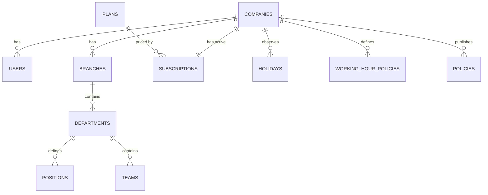

## 6.4 Employee (Agent) Tables

### employees
| Column | Type | Notes |
|---|---|---|
| id | UUID PK | |
| company_id | UUID FK | |
| employee_code | VARCHAR(30) | UNIQUE(company_id, employee_code); auto-generated `EMP-0001` |
| first_name / middle_name / last_name | VARCHAR | |
| gender | ENUM(male, female, other) NULL | |
| date_of_birth | DATE NULL | |
| marital_status | ENUM NULL | |
| national_id | VARCHAR(60) NULL | encrypted at rest |
| photo_path | VARCHAR NULL | S3 |
| email / phone / alt_phone | VARCHAR NULL | |
| address / city / country | VARCHAR NULL | |
| branch_id / department_id / position_id / team_id | UUID FK | team nullable |
| employment_type | ENUM(full_time, part_time, contract, intern) | |
| hire_date | DATE | |
| probation_end_date | DATE NULL | |
| contract_end_date | DATE NULL | |
| employment_status | ENUM(active, probation, suspended, on_leave, terminated, resigned) | |
| termination_date / termination_reason | NULL | |
| reports_to | UUID FK employees NULL | |
| notes | TEXT NULL | |
| created_by | UUID FK users | |

### employee_emergency_contacts
`id, company_id, employee_id FK, name, relationship, phone, alt_phone NULL, address NULL`

### employee_identifications
`id, company_id, employee_id FK, type ENUM(national_id, passport, driver_license, tin, nssf, other), number (encrypted), issue_date NULL, expiry_date NULL, file_path NULL`

### employee_bank_accounts
`id, company_id, employee_id FK, bank_name, branch NULL, account_name, account_number (encrypted), is_primary BOOL, mobile_money_provider NULL, mobile_money_number (encrypted) NULL`

### employee_documents
`id, company_id, employee_id FK, category ENUM(contract, cv, certificate, id_copy, warning_letter, other), title, file_path, file_size, mime_type, uploaded_by FK users, expires_at NULL`

### employee_contracts
`id, company_id, employee_id FK, contract_type ENUM(permanent, fixed_term, probation), start_date, end_date NULL, base_salary NUMERIC(12,2), file_path NULL, status ENUM(active, expired, terminated)`

### employee_salaries (versioned salary info)
`id, company_id, employee_id FK, effective_from DATE, base_salary NUMERIC(12,2), pay_frequency ENUM(monthly, biweekly, weekly), currency, created_by` — current salary = latest `effective_from <= today`

### ER — Employee

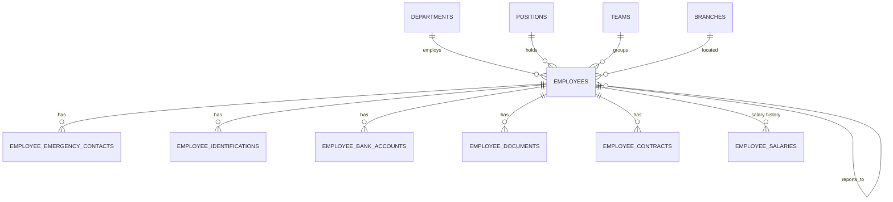

## 6.5 Recruitment Tables

### job_positions
`id, company_id, title, department_id FK, position_id FK NULL, description TEXT, requirements TEXT, openings SMALLINT, employment_type ENUM, salary_range_min/max NULL, status ENUM(draft, open, on_hold, closed), opened_at, closes_at NULL, created_by`

### applicants
`id, company_id, job_position_id FK, first_name, last_name, email, phone, cv_path NULL, cover_letter TEXT NULL, source ENUM(referral, walk_in, agency, online, other), stage ENUM(applied, screening, interview, offer, hired, rejected), rejected_reason NULL, rating SMALLINT NULL, notes TEXT NULL, created_by`
Index: `(company_id, job_position_id, stage)`

### interviews
`id, company_id, applicant_id FK, round SMALLINT, type ENUM(phone, onsite, video, assessment), scheduled_at TIMESTAMPTZ, duration_minutes, interviewer_user_id FK users NULL, location NULL, status ENUM(scheduled, completed, cancelled, no_show), score SMALLINT NULL, feedback TEXT NULL`

### onboarding_checklists / onboarding_tasks
`onboarding_checklists: id, company_id, name, is_default`
`onboarding_tasks: id, company_id, checklist_id FK, title, description NULL, sort_order`

### employee_onboardings / employee_onboarding_tasks
`employee_onboardings: id, company_id, employee_id FK, checklist_id FK, started_at, completed_at NULL, status ENUM(in_progress, completed)`
`employee_onboarding_tasks: id, onboarding_id FK, task_title, is_done BOOL, done_at NULL, done_by FK users NULL`

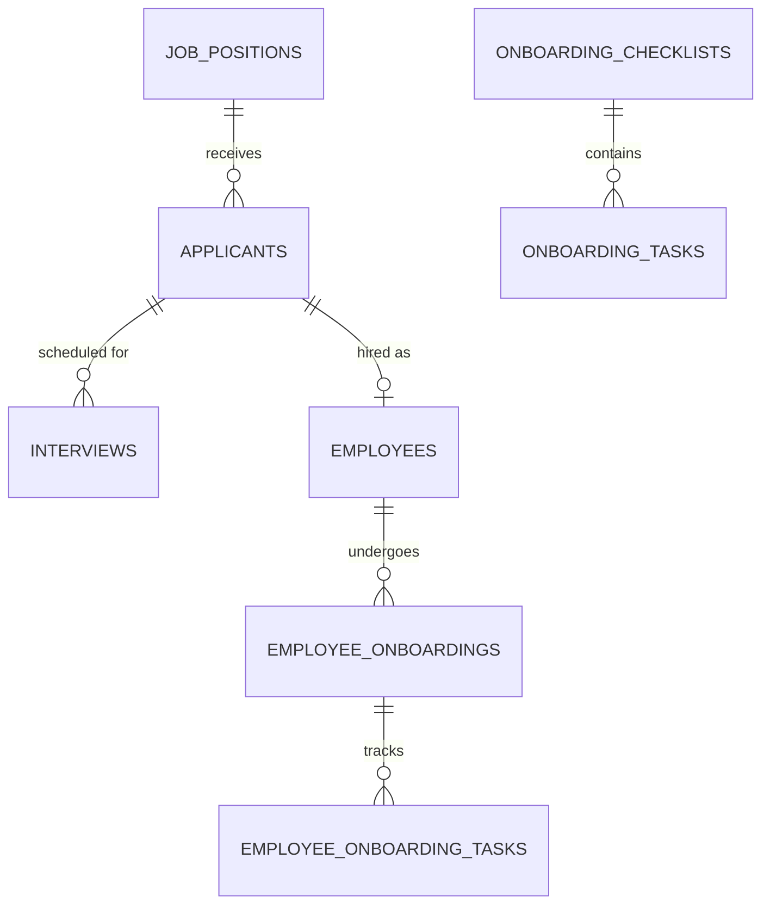

## 6.6 Attendance & Shift Tables

### shifts
`id, company_id, name, code, start_time TIME, end_time TIME, crosses_midnight BOOL, break_minutes SMALLINT, color CHAR(7), is_night_shift BOOL, night_allowance NUMERIC NULL, is_active`

### shift_assignments
`id, company_id, employee_id FK, shift_id FK, date DATE, status ENUM(assigned, swapped, cancelled), assigned_by FK users` — `UNIQUE(company_id, employee_id, date)`

### shift_rotations
`id, company_id, name, pattern JSONB (e.g. [shift_id_A x5, off x2]), cycle_days SMALLINT, applies_to ENUM(team, department, employees), team_id/department_id NULL, starts_on DATE, is_active`
Generation job expands rotations into `shift_assignments` for a planning horizon (e.g. 8 weeks ahead).

### attendance_records
| Column | Type | Notes |
|---|---|---|
| id, company_id | | |
| employee_id | FK | |
| date | DATE | UNIQUE(company_id, employee_id, date) |
| shift_assignment_id | FK NULL | |
| check_in / check_out | TIMESTAMPTZ NULL | entered by Admin (manual or bulk import) |
| status | ENUM(present, absent, late, half_day, on_leave, holiday, off) | |
| late_minutes | INT DEFAULT 0 | computed vs shift start + grace |
| early_leave_minutes | INT DEFAULT 0 | |
| worked_minutes | INT | computed |
| overtime_minutes | INT DEFAULT 0 | above policy threshold; approval flag |
| overtime_approved | BOOL DEFAULT false | |
| source | ENUM(manual, bulk_import, correction) | |
| remarks | TEXT NULL | |
| recorded_by | FK users | |
Indexes: `(company_id, date)`, `(company_id, employee_id, date)`

### attendance_corrections
`id, company_id, attendance_record_id FK, field, old_value, new_value, reason, corrected_by, corrected_at` — every edit to a locked record is journaled.

## 6.7 Leave Tables

### leave_types
`id, company_id, name, code, days_per_year NUMERIC(5,2), is_paid BOOL, carry_forward BOOL, max_carry_forward NUMERIC NULL, requires_attachment BOOL, gender_restriction ENUM(any, male, female), is_active` — `UNIQUE(company_id, code)`

### leave_balances
`id, company_id, employee_id FK, leave_type_id FK, year SMALLINT, entitled NUMERIC(5,2), carried_over NUMERIC(5,2), used NUMERIC(5,2), remaining GENERATED` — `UNIQUE(company_id, employee_id, leave_type_id, year)`

### leave_requests
`id, company_id, employee_id FK, leave_type_id FK, start_date, end_date, days NUMERIC(4,1), half_day ENUM(none, am, pm), reason TEXT, attachment_path NULL, status ENUM(pending, approved, rejected, cancelled), decided_by FK users NULL, decided_at NULL, decision_note NULL, recorded_by FK users`
Index: `(company_id, employee_id, start_date)`, `(company_id, status)`

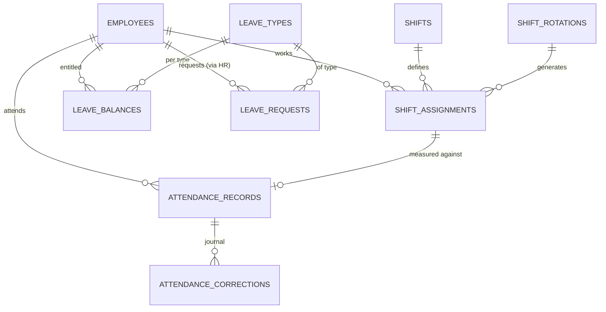

## 6.8 Payroll Tables

### salary_components
`id, company_id, name, code, type ENUM(allowance, deduction), calc_type ENUM(fixed, percent_of_basic, formula), value NUMERIC(12,4), is_taxable BOOL, is_statutory BOOL (e.g. NSSF, PAYE), is_active` — `UNIQUE(company_id, code)`

### employee_salary_components
`id, company_id, employee_id FK, salary_component_id FK, override_value NUMERIC NULL, effective_from DATE, effective_to NULL`

### payroll_runs
`id, company_id, period_year SMALLINT, period_month SMALLINT, status ENUM(draft, processing, review, approved, paid, locked), total_gross NUMERIC, total_deductions NUMERIC, total_net NUMERIC, employee_count INT, processed_by FK users, approved_by FK users NULL, paid_at NULL` — `UNIQUE(company_id, period_year, period_month)`

### payslips
| Column | Type | Notes |
|---|---|---|
| id, company_id | | |
| payroll_run_id | FK | |
| employee_id | FK | |
| basic_salary | NUMERIC(12,2) | snapshot |
| total_allowances / total_deductions | NUMERIC | |
| overtime_hours | NUMERIC(6,2) | from attendance |
| overtime_amount | NUMERIC | |
| bonus / commission | NUMERIC | |
| gross_pay / net_pay | NUMERIC | |
| working_days / present_days / absent_days / leave_days | SMALLINT | snapshot |
| pdf_path | VARCHAR NULL | generated PDF on S3 |
| status | ENUM(draft, final) | |
`UNIQUE(payroll_run_id, employee_id)`

### payslip_lines
`id, payslip_id FK, component_code, label, type ENUM(earning, deduction), amount NUMERIC(12,2), sort_order` — immutable snapshot of each line item.

### bonuses / commissions (input tables)
`bonuses: id, company_id, employee_id, period_year, period_month, amount, reason, created_by`
`commissions: id, company_id, employee_id, period_year, period_month, amount, basis TEXT NULL (e.g. conversions), created_by`

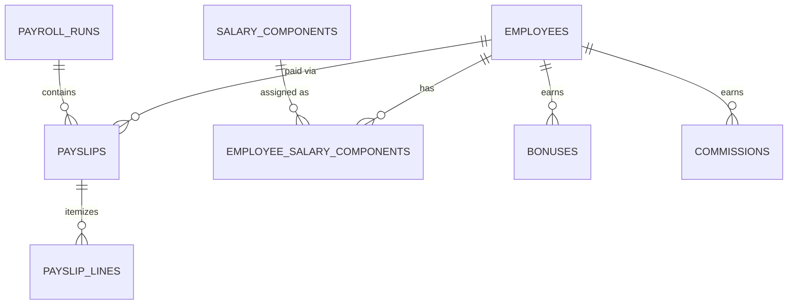

## 6.9 Performance, Analytics & Quality Tables

### kpis
`id, company_id, name, code, unit ENUM(count, percent, seconds, score, currency), direction ENUM(higher_better, lower_better), weight NUMERIC(5,2), applies_to ENUM(agent, team), is_active` — `UNIQUE(company_id, code)`

### kpi_targets
`id, company_id, kpi_id FK, scope ENUM(company, department, team, employee), department_id/team_id/employee_id NULL, period_year, period_month NULL (null = annual), target_value NUMERIC(14,4)`

### agent_daily_stats  (call center analytics fact table)
| Column | Type |
|---|---|
| id, company_id, employee_id FK | |
| date DATE | UNIQUE(company_id, employee_id, date) |
| total_calls INT | |
| answered_calls INT | |
| missed_calls INT | |
| outbound_calls INT | |
| talk_time_seconds INT | |
| hold_time_seconds INT | |
| wrap_time_seconds INT | |
| aht_seconds INT (computed) | |
| conversions INT | |
| csat_score NUMERIC(4,2) NULL | |
| source ENUM(manual, csv_import) | |
| imported_batch_id UUID NULL | |
Indexes: `(company_id, date)`, `(company_id, employee_id, date)` — partition by month at scale.

### performance_evaluations
`id, company_id, employee_id FK, period_year, period_month, kpi_scores JSONB [{kpi_id, actual, target, score}], weighted_score NUMERIC(5,2), rank_in_team INT NULL, rank_in_company INT NULL, grade ENUM(A,B,C,D,E), evaluated_by FK users, comments TEXT, status ENUM(draft, finalized)` — `UNIQUE(company_id, employee_id, period_year, period_month)`

### quality_evaluation_forms / quality_form_criteria
`forms: id, company_id, name, description, max_score, is_active`
`criteria: id, form_id FK, label, weight NUMERIC(5,2), max_points SMALLINT, sort_order`

### quality_evaluations
`id, company_id, employee_id FK, form_id FK, call_reference NULL, evaluated_at, evaluator_user_id FK, scores JSONB [{criterion_id, points, note}], total_score NUMERIC(5,2), percentage NUMERIC(5,2), outcome ENUM(pass, fail, coaching_required), summary TEXT`

### coaching_notes
`id, company_id, employee_id FK, quality_evaluation_id FK NULL, note TEXT, action_items TEXT NULL, follow_up_date DATE NULL, status ENUM(open, done), created_by FK users`

## 6.10 Platform Support Tables

### audit_logs (append-only)
`id BIGSERIAL, company_id, user_id NULL, action VARCHAR (e.g. employee.updated), auditable_type, auditable_id, old_values JSONB NULL, new_values JSONB NULL, ip_address INET, user_agent TEXT, occurred_at TIMESTAMPTZ`
Indexes: `(company_id, occurred_at)`, `(company_id, auditable_type, auditable_id)` — no UPDATE/DELETE grants; partitioned monthly.

### notifications
`id, company_id, user_id FK, type, title, body, data JSONB, channel ENUM(in_app, email, both), read_at NULL, created_at` — index `(user_id, read_at)`

### csv_import_batches
`id, company_id, module ENUM(attendance, agent_stats, employees), file_path, total_rows, success_rows, failed_rows, error_report_path NULL, status ENUM(pending, processing, done, failed), imported_by`

### system_settings
`id, company_id, key, value JSONB` — `UNIQUE(company_id, key)` (payroll day, attendance lock day, notification prefs, 2FA policy, etc.)

## 6.11 Master ER Diagram (core relationships)

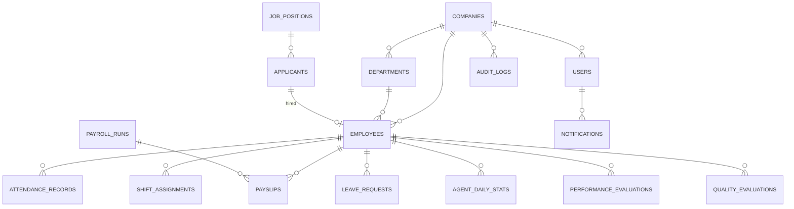

---

# 7. API Architecture

## 7.1 Standards

- Base URL: `https://api.{domain}/api/v1` — URI versioning.
- Auth: `Authorization: Bearer <token>` (Sanctum). All endpoints tenant-scoped from the token.
- Format: JSON only. Envelope:

```json
{ "success": true, "data": { }, "meta": { "page": 1, "per_page": 25, "total": 480 } }
{ "success": false, "error": { "code": "VALIDATION_ERROR", "message": "…", "fields": { "email": ["taken"] } } }
```

- Pagination: `?page=&per_page=` (max 100). Filtering: `?filter[status]=active&filter[department_id]=…`. Sorting: `?sort=-hire_date`. Search: `?q=`.
- Errors: 400 validation, 401 unauthenticated, 403 forbidden, 404 not found (also used for cross-tenant IDs — never 403, to avoid existence leaks), 409 conflict, 422 domain rule, 423 locked (payroll/attendance lock), 429 rate limited.
- Idempotency: mutating financial endpoints accept `Idempotency-Key` header.
- Rate limits: 60 req/min authenticated default; 10/min on auth endpoints; 5/min on exports.

## 7.2 Endpoint Catalogue (representative — pattern repeats per module)

### Authentication

| Method | URL | Permission | Request (key fields) | Response |
|---|---|---|---|---|
| POST | /auth/register | public | company_name, name, email, password | company + owner + verification email |
| POST | /auth/login | public | email, password | token pair OR `2fa_required` + pending token |
| POST | /auth/2fa/verify | pending token | code | token pair |
| POST | /auth/refresh | refresh token | — | new token pair |
| POST | /auth/logout | any | — | 204 |
| POST | /auth/forgot-password, /auth/reset-password | public | email / token+password | 204 |
| GET/DELETE | /auth/sessions, /auth/sessions/{id} | any | — | session list / revoke |

Validation examples: `email: required|email|max:190`, `password: required|min:12|zxcvbn:3`, register throttled 3/hour/IP.

### Company & Owner APIs (role: owner)

| Method | URL | Purpose |
|---|---|---|
| GET/PUT | /company | Profile & branding (name, logo upload via signed URL, colors, timezone, currency) |
| GET | /company/dashboard | Owner dashboard aggregates |
| GET/POST | /company/admins, /company/admins/invitations | List admins / invite admin |
| DELETE | /company/admins/{id} | Remove admin (revokes tokens, audit-logged) |
| GET | /company/subscription · POST /company/subscription/upgrade · /cancel | Billing |
| GET | /company/invoices, /company/invoices/{id}/pdf | Invoices |
| GET | /company/audit-logs | Filterable audit trail |
| GET/PUT | /company/settings | System settings |
| GET | /company/reports/business-summary, /payroll-summary, /employee-statistics | Owner reports |

### Organization APIs (role: admin)

CRUD sets, all `GET/POST /…`, `GET/PUT/DELETE /…/{id}`:
`/branches` · `/departments` · `/positions` · `/teams` · `/working-hour-policies` · `/holidays` · `/policies` · `/leave-types` · `/salary-components` · `/shifts` · `/kpis` · `/quality-forms`

### Employee Management APIs (role: admin)

| Method | URL | Notes |
|---|---|---|
| GET | /employees | filters: status, department_id, team_id, position_id, employment_type, q |
| POST | /employees | full profile payload; validates unique code, plan employee limit (403 PLAN_LIMIT) |
| GET/PUT | /employees/{id} | |
| DELETE | /employees/{id} | soft delete; blocked if referenced by unlocked payroll |
| POST | /employees/{id}/terminate | date, reason → status change + audit |
| GET/POST/DELETE | /employees/{id}/documents… | S3 signed upload/download |
| GET/POST | /employees/{id}/contracts, /bank-accounts, /identifications, /emergency-contacts | sub-resources |
| GET/POST | /employees/{id}/salaries | salary history (versioned) |
| POST | /employees/import | CSV batch (queued), returns batch id |

Validation (create): `first_name/last_name required|max:80`, `hire_date required|date|before_or_equal:today+30d`, `department_id required|exists-in-tenant`, `base_salary numeric|min:0`.

### Attendance APIs (role: admin)

| Method | URL | Notes |
|---|---|---|
| GET | /attendance?date=&department_id=&status= | daily grid |
| POST | /attendance | single record {employee_id, date, check_in, check_out, remarks} |
| POST | /attendance/bulk | mark many (e.g. all present) in one call |
| PUT | /attendance/{id} | correction (requires reason once day locked → 423 unless correction flow) |
| POST | /attendance/import | CSV batch |
| GET | /attendance/missing?date= | employees without a record |
| POST | /attendance/{id}/approve-overtime | |
| GET | /attendance/summary?from=&to= | aggregates for reports/payroll preview |

Domain rules: check_out > check_in; crosses-midnight handled via shift flag; records lock N days after month end (setting) — later edits only via correction endpoint with mandatory reason.

### Shift & Leave APIs (role: admin)

`/shift-assignments` (GET grid ?week=, POST single, POST /bulk, POST /rotations/{id}/generate) · `/leave-requests` (GET ?status=, POST on behalf of employee, POST /{id}/approve, POST /{id}/reject {note}, POST /{id}/cancel) · `/leave-balances?year=` (GET, POST /adjust with reason).
Leave validation: overlapping approved leave → 409; insufficient balance → 422 `INSUFFICIENT_BALANCE`; attachment required if leave type demands it.

### Payroll APIs (role: admin)

| Method | URL | Notes |
|---|---|---|
| POST | /payroll/runs | {year, month} → creates draft, queues calculation |
| GET | /payroll/runs, /payroll/runs/{id} | status + totals |
| GET | /payroll/runs/{id}/payslips | drill-down |
| PUT | /payroll/payslips/{id} | adjust line items while run in review |
| POST | /payroll/runs/{id}/recalculate | re-pulls attendance/OT/bonus/commission |
| POST | /payroll/runs/{id}/approve | review → approved (idempotent) |
| POST | /payroll/runs/{id}/mark-paid | approved → paid; generates payslip PDFs (queued); locks run |
| GET | /payroll/payslips/{id}/pdf | signed URL |
| CRUD | /bonuses, /commissions | period inputs |

Rules: one run per month (409); no edits after `locked`; every state transition audit-logged; Owner has read-only `GET /company/reports/payroll-summary`.

### Performance, Analytics & Quality APIs (role: admin)

`/kpi-targets` CRUD · `/agent-stats` (GET ?from&to&employee_id, POST daily entry, POST /import CSV) · `/analytics/overview?period=` (calls, answered, missed, AHT, CSAT, conversion, trends) · `/evaluations` (POST /generate {year,month} queued — computes weighted scores + rankings; GET, PUT draft, POST /{id}/finalize) · `/quality-evaluations` CRUD · `/coaching-notes` CRUD.

### Reports APIs

`GET /reports/{type}` with `?from&to&department_id&format=json|csv|xlsx|pdf` where type ∈ employees, attendance, payroll, recruitment, performance, call-center, kpi, audit. Non-JSON formats are queued exports: response `202 {export_id}`; `GET /exports/{id}` → status + signed download URL. WebSocket event `export.ready` notifies completion.

### Notifications

`GET /notifications?unread=1` · `POST /notifications/{id}/read` · `POST /notifications/read-all`

## 7.3 Real-Time (WebSockets)

Laravel Reverb, private channels `private-company.{company_id}.user.{user_id}`. Events: `payroll.run.completed`, `export.ready`, `import.completed`, `leave.request.recorded`, `subscription.status.changed`. Channel authorization verifies user ∈ company.

---

# 8. Frontend Architecture

## 8.1 Stack & Structure

React 19 + TypeScript + Vite. UI: Tailwind CSS + shadcn/ui (Radix primitives), Recharts for charts, TanStack Table for data grids, TanStack Query for server state, Zustand for light client state, React Hook Form + Zod for forms (Zod schemas generated from API validation contract), React Router v7.

```
src/
├── app/                 # router, providers, layouts (OwnerLayout, AdminLayout, AuthLayout)
├── features/
│   ├── auth/            # login, 2fa, invitation-accept, sessions
│   ├── dashboard/       # owner + admin dashboards
│   ├── employees/       # list, profile tabs, wizard form
│   ├── recruitment/     # jobs, kanban pipeline, interviews, onboarding
│   ├── attendance/      # daily grid, corrections, imports
│   ├── shifts/          # schedule calendar, rotations
│   ├── leave/           # requests, balances
│   ├── payroll/         # runs, review, payslips
│   ├── performance/     # kpis, targets, evaluations, rankings
│   ├── analytics/       # call center dashboards
│   ├── quality/         # forms, evaluations, coaching
│   ├── reports/         # report center + exports
│   ├── company/         # profile, branding, admins, billing, settings, audit
│   └── notifications/
├── components/ui/       # shadcn components
├── components/shared/   # DataTable, PageHeader, EmptyState, ConfirmDialog, StatCard, FilterBar
├── lib/                 # api client (axios + interceptors), auth store, ws client, utils
└── types/               # generated API types
```

## 8.2 Frontend Rules

- **Route guards** by role: `/owner/*` vs `/admin/*` trees; unauthorized → 403 page.
- **Token handling:** access token in memory; refresh token in httpOnly secure cookie; silent refresh via interceptor; auto-logout broadcast across tabs.
- **Permissions-aware UI:** `<Can permission="payroll.process">` wrapper hides/disables controls (server remains source of truth).
- **Optimistic updates** only for low-risk actions (mark notification read); never for payroll/attendance.
- **Table conventions:** server-side pagination/sort/filter, column visibility, saved filters, sticky header, bulk-select with action bar, CSV export button.
- **Design tokens:** tenant branding (logo + primary color) injected as CSS variables at login.
- **i18n-ready** (react-i18next), en default; RTL-safe layout. Dark mode via class strategy.
- **Accessibility:** WCAG 2.1 AA — Radix primitives, focus management in dialogs, aria on tables.

---

# 9. Backend Architecture

## 9.1 Layered Structure (Modular Monolith)

```
app/
├── Modules/
│   ├── Company/        # profile, branches, departments, positions, settings
│   ├── Identity/       # users, auth, 2fa, invitations, sessions
│   ├── Employee/
│   ├── Recruitment/
│   ├── Attendance/
│   ├── Shift/
│   ├── Leave/
│   ├── Payroll/
│   ├── Performance/
│   ├── Analytics/
│   ├── Quality/
│   ├── Reporting/
│   ├── Billing/
│   ├── Audit/
│   └── Notification/
│   └── <Module>/{Http,Models,Services,Actions,Policies,Events,Jobs,Resources,Database}
├── Support/            # TenantContext, TenantScope, FeatureGate, Money, shared traits
```

Pattern per module: **Controller (thin) → FormRequest (validation) → Action/Service (business logic, DB transaction) → Model (TenantScope, casts, relations) → API Resource (response shaping)**. Domain events (`EmployeeHired`, `PayrollRunApproved`, `LeaveApproved`) fan out to listeners for audit, notifications, cache invalidation.

## 9.2 Asynchronous Work (Redis Queues + Horizon)

| Queue | Jobs |
|---|---|
| `default` | notifications, emails, audit fan-out |
| `heavy` | payroll calculation, evaluation generation, report exports |
| `imports` | CSV batches (chunked, per-row error report) |
| `pdfs` | payslip & invoice PDF rendering (Browsershot/dompdf) |

Scheduler (cron): daily missing-attendance digest, contract/probation expiry alerts (30/7 days), leave balance annual accrual + carry-forward job (Jan 1), attendance lock job, rotation expansion, DB backup trigger, trial-expiry notices.

## 9.3 Caching Strategy

Redis: dashboard aggregates (5 min TTL, tag-invalidated on writes), reference data (departments, shifts — invalidate on change), plan/feature flags per tenant, rate limiter buckets, idempotency keys (24h).

---

# 10. Modules — Detailed Design

Each module below defines: purpose, key features, main rules, and primary flows. (Tables in §6, endpoints in §7, screens in §12.)

## 10.1 Dashboard Module

**Company Owner Dashboard** — read-only strategic view:
Stat cards: Total Employees, Active Employees, Departments, Monthly Payroll (latest locked run). Widgets: Attendance Summary (30-day present/absent/late trend line), Performance Summary (avg score gauge + top teams), Headcount by department (bar), Payroll trend 12 months (line), Quick links to business reports. Data via `/company/dashboard`, cached 5 min.

**Administrator Dashboard** — operational cockpit:
Stat cards: Total Agents, Today's Attendance (present/total + %), Missing Attendance (count → click = fix list), Pending Leave Requests. Widgets: Shift Overview today (per-shift headcount vs planned), Payroll Status (current month run stage stepper), Performance Overview (this month avg + best/worst teams), Recruitment Status (open jobs, pipeline counts), Action Center (contracts expiring, probations ending, unapproved overtime).

## 10.2 Company Management

Company profile (legal + contact + branding with live preview), branches, hierarchical departments, positions with levels & salary bands, working-hour policies (grace minutes, OT threshold), holiday calendar (recurring support, per-branch), policy document library (versioned, active/inactive).
Rules: cannot delete a department/position with active employees (reassign first); deactivation is the soft path; branding limited to logo + primary color to keep UI consistent.

## 10.3 Employee Management

360° profile in tabs: Overview · Personal · Contact & Emergency · Identification · Employment (dept/position/team/type/status, reports-to) · Contract history · Salary (versioned) · Bank/Mobile-money · Documents · Attendance snapshot · Leave snapshot · Performance snapshot · Notes.
Key rules: employee_code auto-generated, immutable; status transitions guarded (`active → suspended/on_leave/terminated/resigned`); termination wizard (date, reason, final-settlement note) removes from future rotations and payroll runs after the period; documents virus-scanned on upload, max 20 MB; NID/bank numbers encrypted, masked in UI (last 4), reveal action audit-logged.

## 10.4 Recruitment Management

Pipeline: **Job Position → Applicants (kanban: Applied → Screening → Interview → Offer → Hired/Rejected) → Interviews (rounds, scores, feedback) → Hire → Onboarding checklist.**
Hire action converts an applicant into an employee via prefilled wizard and links records; onboarding instantiates the default checklist with task ticking. Rules: job must be `open` to accept applicants; hiring auto-decrements openings and closes job at 0 (confirm prompt); rejected applicants keep records for 12 months (configurable) for talent pool search.

## 10.5 Attendance Management

Admin-operated daily grid: one row per active agent per day, quick statuses (Present/Absent/Late/Half-day/On-leave/Off), inline check-in/out times, bulk "mark all present", CSV import with row-level error report. Late/early/worked/OT minutes computed automatically against the assigned shift + grace. Overtime requires explicit approval to count in payroll. Month locks on configurable day; post-lock edits only through the correction flow (reason mandatory, journaled). Leave approvals auto-write `on_leave` attendance rows; holidays auto-write `holiday` rows.

## 10.6 Shift Management

Shift catalog (start/end, break, night flag + allowance, crosses-midnight). Weekly/monthly schedule planner: grid of agents × days, drag-assign, copy-week, conflict detection (double assignment, assignment during approved leave → warning). Rotation engine: pattern definitions (e.g. 5×Morning, 2×Off) expanded 8 weeks ahead by scheduled job; regeneration preserves manual overrides. Night-shift coverage view highlights understaffed nights.

## 10.7 Leave Management

Admin records requests on behalf of agents (system-of-record model). Balance engine: annual entitlement per type, carry-forward caps, mid-year joiners prorated. Approval updates balance + attendance atomically; rejection requires note; cancellation of approved leave restores balance and reverts attendance rows. Overlap and insufficient-balance validations. Yearly accrual job every Jan 1 with carry-forward calculation and audit entries.

## 10.8 Payroll Management

Monthly run lifecycle: **Draft → Processing (queued calc) → Review → Approved → Paid → Locked.**
Calculation per agent: basic (from versioned salary) → + allowances (fixed/% of basic) → + approved OT (rate = hourly × multiplier setting) → + bonuses + commissions for the period → − deductions (incl. statutory components, unpaid-leave/absence deduction = daily rate × unpaid days) → net. Every figure snapshotted into payslip + lines (immutable after lock). Review screen allows per-payslip adjustments with reason. Mark-paid generates branded PDF payslips (queued) to S3. Exceptions surfaced: missing bank account, zero attendance, negative net. Owner sees summary only.

## 10.9 Agent & Performance Management

Agent view = employee list pre-filtered to agent-level positions with team/shift columns. KPI registry (AHT, answered %, CSAT, conversion, QA score, adherence…), weighted per company; targets at company/department/team/agent scope. Monthly evaluation job aggregates `agent_daily_stats` + QA into weighted scores, grades (A–E via configurable bands), team and company rankings; HR reviews drafts, adds comments, finalizes (immutable). Leaderboard view with trend sparklines.

## 10.10 Call Center Analytics

Dashboards over `agent_daily_stats`: totals & rates (answered/missed), AHT, CSAT, conversion; slicing by date range, department, team, agent; day-of-week heatmap; team comparison; agent drill-down. Data entry: quick daily form or CSV import mapped to the fact table (batch with validation report). Explicit note in UI: data source is manual/import in v1; PBX integration is roadmap.

## 10.11 Quality Management

Evaluation form builder (criteria, weights, points). QA evaluations reference an agent + optional call reference; scoring UI computes weighted totals and pass/fail/coaching outcome; failing scores auto-suggest a coaching note. Coaching notes track action items, follow-up dates, open/done status; overdue follow-ups appear in Admin Action Center. QA score feeds the performance KPI set.

---

# 11. Reports Module

Central **Report Center**: pick report → filters (period, branch, department, team, employee, status) → preview table/charts → export CSV/XLSX/PDF (queued, notified via WebSocket + in-app).

| Report | Contents |
|---|---|
| Employee Reports | headcount snapshot & trend, by dept/branch/type/status, joiners & leavers, contract/probation expiries, demographics |
| Attendance Reports | daily register, monthly summary per agent (present/absent/late/OT), late & absence rankings, OT summary |
| Payroll Reports | run register, payroll summary by month/dept, component breakdown, bank transfer file (CSV), statutory deduction report, YTD per employee |
| Recruitment Reports | pipeline funnel & conversion, time-to-hire, source effectiveness, interviewer activity |
| Performance Reports | monthly scorecards, rankings, KPI achievement vs target, grade distribution, trend per agent/team |
| Call Center Reports | volume & rates, AHT trends, CSAT trends, conversion, team comparison, heatmaps |
| KPI Reports | target vs actual matrix per scope, exceptions (missed targets) |
| Audit Reports | filterable audit trail (user, action, module, date), login history, payroll-change log |

Access: Administrator = all; Owner = business summary, employee statistics, payroll summary, audit reports.

---

# 12. UI/UX Design & Screens

## 12.1 Design System

Enterprise aesthetic in the SuccessFactors/Workday/BambooHR class: light neutral canvas, tenant primary color for actions, 8-pt spacing grid, Inter typeface, left sidebar (collapsible, 260px) + top bar (global search ⌘K, notifications bell, user menu), content max-width 1440px. Density toggle on tables. Every list screen = PageHeader (title, primary action) + FilterBar + DataTable + pagination. Every destructive action = typed-confirmation dialog. Toast feedback on all mutations.

**States, mandatory on every screen:** Loading (skeleton rows/cards), Empty (icon + one-line explanation + primary CTA, e.g. "No employees yet — Add your first employee"), Error (retry), No-results (clear-filters CTA).

## 12.2 Screen Inventory (purpose · layout · key elements)

**Auth:** Login (split layout, brand panel + form; email, password, remember, forgot; 2FA step) · Register (3-step: account → company → done) · Invitation Accept (set password + 2FA setup).

**Owner — Dashboard:** stat card row (4) → charts grid 2×2 (headcount by dept bar, payroll 12-mo line, attendance 30-d line, performance gauge) → recent audit events list. Actions: date-range switch, export snapshot PDF.

**Owner — Administrators:** table (name, email, 2FA badge, last login, status) · actions: Invite (modal: email), Resend, Revoke invitation, Remove admin (typed confirm) · empty state "No administrators yet — invite your HR lead."

**Owner — Billing:** current plan card (usage bars: employees, admins), plan comparison grid, payment method, invoice table (download PDF), cancel flow with retention notice.

**Owner — Audit Logs:** filter bar (user, module, action, date) + timeline-style table with old→new diff drawer.

**Owner — Settings / Company Profile / Branding:** tabbed form; branding tab has live sidebar preview.

**Admin — Dashboard:** stat cards (agents, today's attendance %, missing count, pending leaves) → Action Center list → shift coverage widget → payroll stepper → recruitment funnel mini → performance sparkline.

**Admin — Employees List:** DataTable (photo+name, code, department, position, team, shift, status chip, hire date) · filters (status, dept, team, type) + search · bulk bar (export, assign shift, change team) · primary action "Add Employee" (5-step wizard: Personal → Employment → Salary & Bank → Documents → Review).

**Admin — Employee Profile:** header card (photo, name, code, status chip, quick actions: Edit, Terminate, Add Document) + tab strip (Overview, Personal, Employment, Contract, Salary, Bank, Documents, Attendance, Leave, Performance, Notes). Attendance tab shows month calendar heat view.

**Admin — Recruitment:** Jobs list → Job detail with applicant kanban (drag between stages; stage-change side panel) → Applicant profile (CV preview, interviews timeline, rating) → Interview scheduler (calendar slot picker) → Onboarding board (checklist progress per new hire).

**Admin — Attendance Daily:** date picker + department filter → grid (agent, shift, check-in, check-out, status select, late min, OT min, remarks) with inline editing, bulk "mark present", Missing tab, Import button (upload → column mapping → validation report → commit).

**Admin — Shift Schedule:** week/month toggle calendar grid agents×days, colored shift chips, drag to assign, conflict badges, Copy last week, Generate from rotation, coverage totals footer.

**Admin — Leave:** Requests table (agent, type, dates, days, status, actions Approve/Reject with note) · Record Leave modal (agent, type — shows live balance, dates, half-day, reason, attachment) · Balances screen (matrix agents×types with adjust action).

**Admin — Payroll:** Runs list (period, status stepper chip, totals) → Run detail: summary cards (gross/deductions/net/employees) + exceptions banner + payslip table (drill to payslip drawer: earnings/deductions lines, adjust while in Review) + primary actions per state (Process → Review → Approve → Mark Paid) each gated + confirmed · Payslip PDF preview.

**Admin — Performance:** KPI settings table · Targets matrix editor · Evaluations list by month (generate button) → Evaluation detail (KPI table actual/target/score, grade, comments, Finalize) · Leaderboard (rank, agent, score, trend, grade chips).

**Admin — Analytics:** filter bar (range, dept, team, agent) → stat cards (calls, answered %, missed, AHT, CSAT, conversion) → trend lines, team comparison bars, weekday heatmap → Data Entry tab (daily form + import).

**Admin — Quality:** Forms builder (criteria rows with weight/points) · Evaluations list + New Evaluation (agent, form, per-criterion scoring with notes, auto total, outcome) · Coaching notes list (status, follow-up date, overdue highlight).

**Admin — Reports:** report card grid → report page (filters, preview, export split-button CSV/XLSX/PDF) → Exports drawer (history + download).

---

# 13. Sidebar Menus

## 13.1 Company Owner

```
▣ Dashboard
▣ Business Reports
   • Business Summary
   • Employee Statistics
   • Payroll Summary
▣ Administrators
▣ Company
   • Profile
   • Branding
▣ Billing
   • Subscription
   • Invoices
▣ Audit Logs
▣ Settings
```

## 13.2 Administrator (HR)

```
▣ Dashboard
▣ Employees
   • All Employees
   • Add Employee
   • Documents Expiry
▣ Recruitment
   • Job Positions
   • Applicants
   • Interviews
   • Onboarding
▣ Attendance
   • Daily Attendance
   • Missing Attendance
   • Corrections
   • Import
▣ Shifts
   • Shift Catalog
   • Schedule Planner
   • Rotations
▣ Leave
   • Requests
   • Balances
   • Leave Types
▣ Payroll
   • Payroll Runs
   • Payslips
   • Salary Components
   • Bonuses & Commissions
▣ Performance
   • KPIs & Targets
   • Evaluations
   • Leaderboard
▣ Call Center Analytics
   • Overview
   • Data Entry / Import
▣ Quality
   • Evaluation Forms
   • Evaluations
   • Coaching Notes
▣ Reports
▣ Organization
   • Branches · Departments · Positions · Teams
   • Working Hours · Holidays · Policies
▣ Settings
```

---

# 14. Security Architecture

| Control | Implementation |
|---|---|
| RBAC & permissions | §5 — roles + permission registry, policies on every model, route middleware |
| Authentication | Sanctum bearer tokens, rotating refresh, argon2id, breached-password check |
| 2FA | TOTP + recovery codes; mandatory for Owner |
| Session management | device list, revoke-all, idle + absolute timeouts, Redis revocation list |
| Rate limiting | Nginx + Laravel limiter: 10/min auth, 60/min API, 5/min exports; per-IP and per-user buckets |
| Tenant data isolation | TenantScope + middleware + PostgreSQL RLS + policy ownership checks (§3) |
| Encryption in transit | TLS 1.2+ everywhere; HSTS; internal service traffic on private network |
| Encryption at rest | Disk-level (LUKS/managed volumes) + column-level (Laravel encrypted casts) for national IDs, bank/mobile-money numbers, 2FA secrets |
| Secrets | .env excluded from images; injected via Docker secrets/vault; key rotation runbook |
| Input safety | FormRequest validation on every endpoint; Eloquent bindings (no raw SQL); output escaping; CSP, X-Frame-Options DENY, X-Content-Type-Options |
| File safety | MIME + extension allow-list, size caps, ClamAV scan queue, S3 private + signed URLs (15 min) |
| CSRF/XSS | Bearer-token API (no cookie CSRF surface except refresh cookie: SameSite=Strict, httpOnly); React escaping; DOMPurify for any rich text |
| IDOR defense | UUIDs + tenant-scoped lookups returning 404 |
| Audit | §15 — immutable, append-only |
| Dependency & image security | Dependabot/Composer audit, Trivy image scans in CI, minimal distroless-style images |
| Backups security | encrypted (AES-256), separate credentials, restore drills |
| Privacy | data-retention windows, tenant export (GDPR-style portability), purge job after cancellation window |

---

# 15. Audit Logging System

- **What:** every create/update/delete on business entities (old/new value diff, sensitive fields masked), auth events (login, failed login, 2FA, password reset, session revoke), authorization denials, payroll state transitions, exports/downloads of sensitive data, billing changes, admin invite/remove.
- **How:** model observers + explicit `Audit::log()` in actions; writes queued (`default`) to avoid request latency; table is append-only (DB grants forbid UPDATE/DELETE), monthly partitions, 24-month retention (Enterprise configurable).
- **Who sees:** Owner (full company trail + audit reports), Admin (operational modules trail). Cross-tenant invisible by construction.
- **Format:** `actor, action (module.verb), entity, diff, ip, user_agent, occurred_at`; searchable/filterable; export to CSV.

---

# 16. Notification System

Channels: **in-app** (bell + list, real-time via Reverb) and **email** (queued, branded templates). Per-user preferences in settings.

| Event | Recipient | Channel |
|---|---|---|
| Admin invitation / accepted | invitee / Owner | email / in-app |
| Payroll run completed / approved / paid | Admins (Owner on paid) | in-app + email |
| Missing attendance daily digest | Admins | in-app + email (08:00 tenant TZ) |
| Contract / probation expiring (30 & 7 days) | Admins | in-app + email |
| Leave recorded / approved / rejected | Admins | in-app |
| Export / import ready or failed | requester | in-app (WS push) |
| Subscription: trial ending, payment failed, plan changed | Owner | email + in-app |
| New login from unknown device | affected user | email |
| QA coaching follow-up overdue | Admins | in-app |

---

# 17. Deployment Architecture

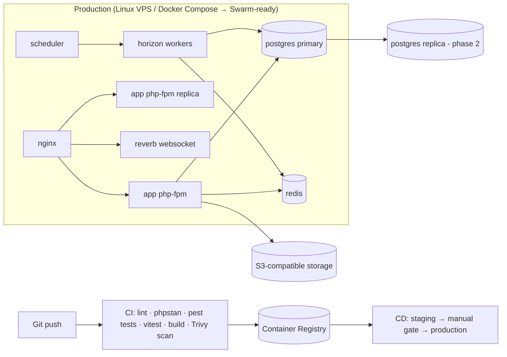

- **Containers:** `nginx`, `app` (php-fpm, N replicas), `horizon`, `scheduler`, `reverb`, `postgres`, `redis`; images built once, promoted through environments; config via env.
- **CI/CD:** GitHub Actions — pipeline: composer/npm install → Pint + PHPStan (level 8) + Pest (feature+unit, tenant-isolation test suite mandatory) → Vitest + tsc → build images → scan → push → deploy staging (auto) → prod (manual approval) → post-deploy smoke tests → migrations with `--force` and zero-downtime pattern (deploy code tolerant of old schema, then migrate).
- **Environments:** local (Sail), staging (anonymized seed data), production.
- **Observability:** structured JSON logs → Loki/ELK; Sentry for errors (FE+BE); Prometheus + Grafana (php-fpm, queue depth, DB, Redis); Horizon dashboard; uptime probes; alerting to ops channel (queue lag, 5xx rate, disk, failed backups).

---

# 18. Backup Strategy

| Asset | Method | Frequency | Retention | Notes |
|---|---|---|---|---|
| PostgreSQL | `pg_dump` logical | nightly 02:00 | 30 daily, 12 monthly | encrypted, off-site S3 bucket |
| PostgreSQL | WAL archiving (PITR) | continuous | 7 days | point-in-time restore |
| S3 documents/payslips | bucket versioning + cross-region replication | continuous | 90-day versions | |
| Redis | RDB snapshot | 6-hourly | 2 days | cache/queues are reconstructible |
| Config/secrets | encrypted vault snapshot | on change | last 10 | |

**RPO ≤ 15 min (WAL), RTO ≤ 4 h.** Monthly automated restore drill to a scratch environment with checksum verification; backup failure pages ops. Tenant-level export tool (full JSON/CSV + files bundle) for offboarding/compliance.

---

# 19. Scaling Strategy

**Phase 1 (launch, single VPS):** vertical headroom, php-fpm tuning, opcache, Redis cache, queue offloading, index discipline.
**Phase 2 (growth):** split DB to managed PostgreSQL + read replica (reports/dashboards routed to replica), multiple app containers behind Nginx/HAProxy, dedicated worker host, CDN for SPA assets.
**Phase 3 (scale):** Kubernetes/Swarm with HPA on app + workers, PgBouncer pooling, monthly partitioning of `attendance_records`, `agent_daily_stats`, `audit_logs`, materialized views for dashboard aggregates (refreshed by scheduler), optional per-tenant schema for very large Enterprise tenants, multi-region DR (replica + S3 replication).
**Always:** stateless app tier (sessions/tokens in Redis/DB), feature gates for gradual rollout, load tests before each phase gate (k6: 500 RPS API, payroll run of 5 000 agents < 10 min).

---

# 20. Permissions Matrix

| Capability | Owner | Admin |
|---|:---:|:---:|
| Register company / edit legal profile & branding | ✅ | ❌ |
| Invite / remove Administrator | ✅ | ❌ |
| Subscription, billing, invoices | ✅ | ❌ |
| Company dashboard & business reports | ✅ | 📊 own ops reports |
| Employee statistics (aggregate) | ✅ read | ✅ |
| View audit logs | ✅ all | ✅ operational modules |
| System settings (company-level) | ✅ | ⚙️ HR configuration only |
| Employees CRUD, documents, contracts | ❌ | ✅ |
| Recruitment (jobs, applicants, interviews, onboarding) | ❌ | ✅ |
| Attendance entry, corrections, imports, OT approval | ❌ | ✅ |
| Shifts, rotations, schedules | ❌ | ✅ |
| Leave types, requests, approvals, balances | ❌ | ✅ |
| Payroll runs: process / adjust / approve / mark paid | ❌ (summary read) | ✅ |
| Salary components, bonuses, commissions | ❌ | ✅ |
| KPIs, targets, evaluations, rankings | ❌ | ✅ |
| Call center analytics + data entry/import | ❌ | ✅ |
| Quality forms, evaluations, coaching | ❌ | ✅ |
| Reports: all operational | ❌ | ✅ |
| Export company data bundle | ✅ | ❌ |
| Agents/employees login | 🚫 does not exist | 🚫 does not exist |

---

# 21. Key Workflows & User Flows

## 21.1 Company Onboarding

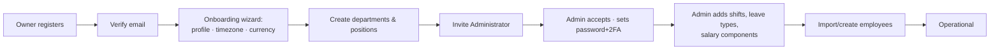

## 21.2 Monthly Payroll

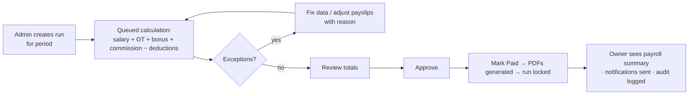

## 21.3 Hire-to-Onboard

Applicant (kanban) → interviews scored → Offer → **Hire** action → employee wizard prefilled → contract + salary recorded → onboarding checklist auto-created → tasks ticked → status `probation` → probation-end alert → confirm `active`.

## 21.4 Daily Attendance Cycle

08:00 digest of yesterday's missing records → Admin opens Daily Attendance → bulk mark + individual edits → OT flagged rows approved → month-end lock job → corrections only via journaled flow → locked data feeds payroll.

---

# 22. Non-Functional Requirements

| Category | Requirement |
|---|---|
| Performance | P95 API < 300 ms (reads), < 800 ms (writes); dashboard < 1.5 s; payroll for 1 000 agents < 3 min |
| Availability | 99.9% monthly; maintenance windows announced in-app |
| Capacity (v1 targets) | 500 tenants, 100 000 employee records, 10 M attendance rows/yr |
| Compatibility | last 2 versions of Chrome/Edge/Firefox/Safari; responsive ≥ 1024 px full, ≥ 768 px functional |
| Accessibility | WCAG 2.1 AA |
| Localization | i18n-ready; tenant timezone & currency respected in every date/money render |
| Data integrity | financial mutations transactional + idempotent; payroll snapshots immutable |
| Testing | ≥ 80% coverage on Services/Actions; mandatory tenant-isolation test suite; E2E happy paths (Playwright) for payroll, attendance, hiring |
| Documentation | OpenAPI 3.1 spec generated from code; ADRs for architecture decisions |

---

*End of document — Call Center HRMS Enterprise SaaS · SAD/SRS v1.0. Ready for sprint planning: recommended build order → Identity & Tenancy → Organization → Employees → Attendance/Shifts → Leave → Payroll → Recruitment → Performance/Analytics/Quality → Reports → Billing hardening.*
